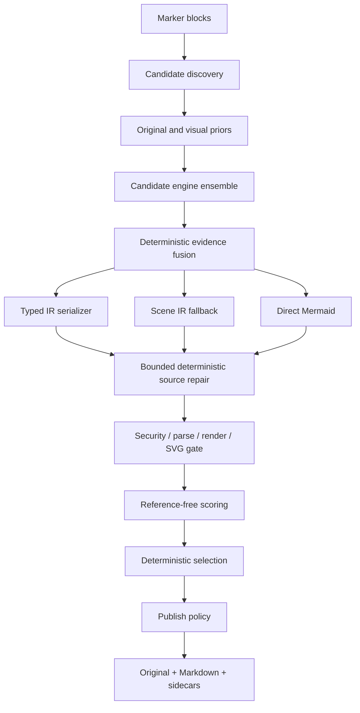

# 아키텍처

## 설계 목표

핵심은 VLM의 문자열 출력을 곧바로 게시하지 않는 것입니다. source, evidence, scene IR,
typed IR, Mermaid candidate, validation artifact를 분리하여 각 단계가 독립적으로 교체되고
실패할 수 있게 했습니다.

## 모듈 경계

| 모듈 | 책임 |
| --- | --- |
| `models.py`, `typed_contracts.py` | hook-free canonical scene/evidence/candidate snapshot, aggregate typed-IR budget과 유형별 extraction root 계약 |
| `discovery.py`, `page_detector.py` | panel/full-page/fragment와 missed page region proposal |
| `marker_discovery.py` | Marker block/current_children adapter, source registry와 dedupe |
| `source_assembly.py` | panel/merged canvas 조립과 source/page affine mapping |
| `geometry.py` | contour, Hough line, arrowhead의 보수적 Scene IR/provenance 변환 |
| `vector.py` | reconstruction-global raw-work budget, observe-local placement index, O(1) page/block lookup으로 제한한 PDF vector/text 추출과 canvas affine 변환 |
| `fusion.py` | vector/geometry/OCR/VLM Scene IR 결정적 병합과 제한된 Flowchart/Generic Network node-ID 정합화 |
| `mapping_validation.py` | node-ID mapping의 공용 bbox/text/contour provenance 정합성 gate |
| `views.py` | type-aware thumbnail/edge/threshold/overlay와 source-resolution tile 생성 |
| `engines.py` | bounded Marker BaseService adapter, stock Ollama inline-schema compatibility와 offline fixture engine |
| `flowchart_structure.py` | node/group ID와 flat disjoint subgraph membership의 공용 emission plan |
| `serializers*.py`, `serialization.py` | software/chart typed IR, requested/emitted type와 fallback 계약 |
| `ast_repair.py` | 의미를 추가하지 않는 bounded lexical/structural repair와 AST adapter seam |
| `semantic_repair.py` | exact text와 고신뢰 line/arrow 근거가 있는 typed flowchart node/conditional-edge label·directed-edge 교정 |
| `style_recovery.py` | trusted PDF vector origin/profile-gated flowchart node·group fill/border/bold와 exact-mapped edge color/style attribution |
| `security.py` | active/external Mermaid syntax의 fail-closed 검사 |
| `validation.py` | bounded nonblocking Chromium protocol, parse/render, SVG 재검사, process-group 정리 |
| `scoring.py` | OCR/numeric score, available-weight aggregation, 게시 결정 |
| `quality.py` | edge/arrow/layout/path 구조 점수와 unavailable 판정 |
| `evaluation.py` | hash-bound corpus manifest와 고정 MMX-001 release gate/report 집계 |
| `candidate_scene.py` | typed serializer가 실제 방출한 node/relation/subgraph 구조를 평가 Scene으로 변환 |
| `accessibility.py` | requested type 기반 bounded 설명과 emitted grammar 지원 판정 |
| `pipeline.py` | budget, failure isolation, selection, 개선 시에만 repair 채택 |
| `marker_integration.py` | processor 순서, Marker OCR provenance, 전용 renderer/converter |
| `sidecars.py`, `output.py` | atomic diagram bundle과 문서 출력 |
| `review_layout.py`, `review_store.py` | source geometry와 분리된 bounded layout hint와 review revision |

`CandidateEngine`, `RepairEngine`, `MermaidRuntime`은 Protocol로 주입됩니다. 기본 Marker/fixture CLI는
evidence-backed flowchart repair를 연결하며 다른 repair engine도 구조화 proposal 계약으로 주입할 수 있습니다. 기본 repair는
exact OCR/vector label과 내장 Geometry engine에서 온 동일 source block의 고신뢰 line/arrow가 지지하는
방향 반전·무라벨 누락 edge만 다룹니다. Connector evidence ID가 충돌하거나 VLM이 새로 선언한 경우에는 구조
수정 권한을 부여하지 않으며 fusion 전 engine 방향 충돌도 별도 pair set으로 보존해 repair를 막습니다. Label
evidence도 초기 Marker OCR 또는 exact Vector engine만 trust하고 ID collision/source block/bbox를 확인합니다.
각 repair 호출은 현재 후보의 닫힌 publication evidence authority로 label/connector/evidence를 먼저 제한한
격리 `SourceContext`와 후보 복사본만 받으므로 prompt에서 빠진 근거를 뒤 repair가 다시 승격할 수 없습니다.
기존 조건 분기 edge label은 trusted OCR/vector text와 unique built-in Geometry connector가 동시에 지지하고
source/typed endpoint가 같은 방향으로 1:1 대응할 때만 label-only로 교정합니다. 이 경로는 topology, node,
endpoint, 방향, layout을 바꾸지 않으며 새 branch나 Yes/No 의미를 추론하지 않고 parallel/reversed edge를
거부합니다.
Repair typed IR은 입력 resource budget과 deterministic code 동기화를 다시 검증합니다. 테스트와 offline
재현은 Marker/LLM/Chromium을 각각 fake로 대체할 수 있습니다.

page proposal에 Figure/Picture/ComplexRegion anchor가 없으면 PageGroup 내부 metadata queue가 processor
사이의 전달 경계가 됩니다. 이 결과와 원본 crop은 sidecar 출력에 포함하지만 자동 Markdown에는
삽입하지 않습니다.

## 좌표와 provenance

`DiagramSceneIR.coordinate_space`는 `pixels` 또는 `normalized`입니다. Marker adapter는 fragment page
bbox와 assembly의 page→canvas affine으로 OCR bbox를 변환합니다. panel 밖 token은 제외하고 multi-page
token에는 fragment offset을 적용합니다. 모든 evidence는 원 Marker block ID를 보존합니다.
Scene relation은 endpoint가 아직 불명확할 때 `None`을 허용하지만, 존재하지 않는 ID 참조는
모델 validation에서 거부합니다.

`NodeIdMapping`은 새 visual evidence가 아니라 owner Scene ID와 fused Scene ID 사이의 audit record입니다.
source/authority owner, vector 또는 geometry authority, `match_method`(`identity`/`unique_iou`), 양쪽
bbox와 기존 evidence ID, canonical claim digest를 기록합니다. record는 immutable이며 pipeline은
selected candidate에 process-private certification seal을 붙입니다. mapping은 provenance를 만들거나 바꾸지 않으며
`source-map.json`의 page/canvas 좌표 책임도 대신하지 않습니다.

## 후보와 budget

engine observation 하나는 type distribution, Scene IR, typed candidates, direct candidates,
evidence를 함께 반환합니다. pipeline은 모든 engine을 failure-isolated 방식으로 호출하고, 앞선
engine의 evidence를 다음 engine context와 view에 합칩니다. payload가 둘 이상이면 명시적
`fusion_source`로 deterministic fusion을 수행하고 fused/원 observation 후보를 round-robin으로
뽑습니다. observation list, typed IR depth/item/text와 direct source에는 입력 budget을 적용하고 각 engine은
candidate budget까지만 직렬화합니다. type top-k와 code hash 중복 제거 후
기본 우선순위는 typed IR, Scene IR fallback, direct Mermaid입니다. 자동 게시 정책의 최종 정렬은
parse/render hard gate 뒤 publish eligibility, aggregate score, OCR recall, generation priority,
candidate ID 순서로 결정적입니다. `review_required`와 `sidecar_only`는 publish eligibility를 정렬에
사용하지 않아 기존 aggregate 중심 검토 순서를 유지합니다.
typed 후보는 prediction의 top-k type 순서로 먼저 filter/reorder한 뒤 candidate budget을 적용합니다.
따라서 top-k에 없는 앞쪽 후보가 안전한 predicted-type 후보의 직렬화 slot을 소비하지 않습니다.
Fusion의 element/relation evidence와 evidence source-block 합집합은 공용 256-reference 상한을 넘기기
전에 중단하고, overflow cluster는 cross-input enrichment 없이 결정적 winner record를 유지합니다.
같은 evidence ID의 모든 입력을 한 번에 판정하므로 앞선 부분 합집합도 남기지 않습니다. 변형 record를
재구성한 뒤 pipeline이 내부 fused Scene/evidence와 exact-list/20,000-item evidence collection 계약을
다시 검증하므로 canonical Scene만 candidate generation, scoring, publication receipt와 sidecar 경계로
이동합니다.

Record별 256개 상한과 별도로, retained `VisualEvidence` collection은 `source_block_ids`의 논리적
occurrence를 합계 20,000개, 그 ID 문자열을 Python `len()` 합계 8,000,000자로 제한합니다. 같은 ID의
중복 occurrence도 메모리 비용이므로 각각 계산합니다. `id`, `kind`, `text`, `font_weight`, source-block
ID를 모두 더한 기존 full-evidence 8,000,000자 상한도 독립적으로 적용됩니다. 각 exact boundary는
허용하고 `+1`은 bounded prefix를 남기지 않고 해당 collection 또는 reconstruction-global 신규 ID batch
전체를 격리합니다. Snapshot은 exact list/model field를 built-in access로 읽고 detached
`VisualEvidence`를 다시 만들며 live `model_dump`, subclass iteration/equality/coercion hook을 호출하지
않습니다.

이 계약은 initial/custom-engine evidence, reconstruction-global whole-new-ID admission, fusion의 모든
observation과 정렬에 포함되는 `prior_evidence` 누적 입력 및 fused output, 최종
`ReconstructionResult`와 publication/Markdown snapshot에 적용됩니다. Sidecar는 JSON/deep copy와 임시
directory 생성 전에, document output은 image 쓰기 전에 같은 final-result snapshot을 preflight합니다.
공개 config나 sidecar schema/manifest version은 바뀌지 않습니다. Marker adapter는 source-crop/OCR
record를 append하기 전에 누적 budget에 admission하고, 초과 시 evidence와 OCR text context 전체를
격리하되 source reconstruction은 계속합니다. Review의 root/revision read, trusted replacement,
digest/commit 및 structured `user_edit` 추가도 raw JSON/model record를 한 건씩 detached canonical
snapshot으로 바꾼 뒤 같은 경계를 적용합니다. Evaluation prediction ingestion은 후속입니다.

fused observation의 `flowchart`와 `generic_network` typed 후보만 별도 ID 정합화 gate를 거칩니다. typed
node가 같은 owner Scene element ID를 정확히 재사용하고, 그 element가 독립 vector/geometry node 하나와
IoU 0.45 이상으로 유일하게 대응하며, source evidence가 engine 호출 전 payload snapshot에 있고 그 bbox
중심과 정규화 text가 owner Scene node에 대응해야 합니다. authority contour도 같은 vector/geometry
observation에서 직접 선언되고 bbox가 authority node와 겹치며 provenance ID가 충돌하지 않아야 합니다.
Pixel Scene canvas와 shared evidence block도 현재 source image 크기 및 trusted source block 집합에
결속합니다.
모든 node가 매핑되고 fused target이 서로 다른 full/injective mapping일 때만 node ID, edge endpoint,
group member를 한 transaction처럼
재작성합니다. 하나라도 불안전하면 후보를 통째로 원래 ID 공간에 두며 partial remap은 하지 않습니다.
mapped endpoint pair의 cross-engine direction conflict도 fused ID로 전파되어 뒤 semantic repair를
차단합니다. nested Swimlane/BPMN과 non-flow typed IR, direct Mermaid, Scene fallback은 이 경로에서
재작성하지 않습니다.

Treemap/Venn/Packet/Ishikawa/TreeView native validation이 실패하면 serializer가 명시한 portable fallback을
같은 candidate slot에서 한 번 재검증합니다. Architecture/C4/Deployment/Component도 `architecture-beta`
runtime validation이 실패할 때 같은 typed IR의 nested Flowchart fallback을 이 경로로 한 번만 시도합니다.
Fallback은 source security, parse/render, SVG와 terminal runtime type gate를 전부 다시 통과해야 하며,
실패는 해당 후보에만 격리됩니다. 성공하면 requested type은 유지하고 emitted/runtime type, 전체
`architecture → flowchart` 또는 `requested → architecture → flowchart` chain, warning과
`runtime_portable_fallback` repair history를 갱신합니다. 같은 slot을 재사용하므로 candidate budget은
늘어나지 않습니다.

Marker 기본 구성에서는 PyMuPDF page provider를 연결한 VectorPrimitiveEngine과 GeometryEngine이 먼저
구조 evidence를 만듭니다. Structured VLM은 bounded structural quota와 문자 예산이 선택한 evidence/OCR
subset을 prompt에서 보고, overlay view는 별도의 검증된 image list로 받습니다. scene node에 읽을 수
있는 label이 하나도 없으면 문법적으로 렌더 가능해도 `U`로 두어 자동 Markdown 게시를 막습니다.

Pipeline은 engine 호출 전에 source block/page ID, OCR, initial evidence, opaque block/vector source list를
각 hard cap보다 하나 많은 항목까지만 읽어 plain snapshot으로 고정합니다. 타입·값·합계 상한을 벗어난
컬렉션은 일부 prefix를 사용하지 않고 해당 컬렉션 전체를 안전한 기본값으로 격리하며
`CandidateFailure(stage="source_context")`를 남깁니다. Engine이 추가한 evidence도 reconstruction 전체의
item/reference/character cap을 공유합니다. 신규 evidence ID batch가 남은 예산을 넘으면 일부 record만
평가·게시 authority에 넣지 않고 batch 전체를 격리합니다.

Vector extraction은 최종 Scene에 남은 record가 아니라 provider에서 읽은 raw work를 독립적으로
계산합니다. 기본 reconstruction-global 예산은 primitive/command 2,048개, vector text
5,000개·총 8,000,000자, vector source 256개입니다. Primitive 설정 상한은 Scene element
5,000개 이하이고 primitive+text 설정 상한의 합은 observation evidence 20,000개 이하입니다.
Provider·source가 바뀌어도 닫힌 count/character dimension은 다시 열리지 않으며 malformed,
out-of-crop, duplicate, 빈 nested drawing input도 작업량을 소모합니다. 모든 iterable은 스트리밍하고
초과 판정에 한 개의 lookahead만 사용합니다. Nested polygon/polyline은 각각 256/512 point에서
완전 record 단위로 닫히며 전체 보존 point 100,000개, vector metadata token 256자,
warning collection 256개도 공유합니다. Exact duplicate hash 뒤 approximate dedup은 250,000회,
text/node와 endpoint matching은 각각 1,000,000회 비교로 닫힙니다. Built-in extractor가 남긴
work count, custom extractor output, 직접 `VectorObservation`은 engine·Scene 경계에서 다시 bound됩니다.
Direct/dict/words의 duck-typed span label은 한 번 읽은 plain snapshot으로 파싱하며 aggregate
문자 예산에 포함됩니다. 같은 최종 경계는 유효·deduplicate된 shape/text/open-line evidence에
canonical source-block ID가 복제될 fan-out을 Scene/evidence 생성 전에 계산합니다. Reconstruction당
20,000 logical reference와 Python 문자열 길이 8,000,000자를 각각 exact boundary까지 허용하고,
어느 한쪽이라도 초과하면 unknown prediction, 빈 Scene/evidence와 단일 warning으로 vector observation
전체를 격리합니다. 이 atomic preflight는 built-in, direct, custom extraction에 공통으로 적용되어
일부 provenance prefix가 게시 authority를 얻지 못하게 합니다. Payload 없는 warning observation은
pipeline에서 bounded generation failure로 바뀌어 result와 sidecar manifest에 남습니다. 공개
config/API는 추가하지 않습니다.
Built-in vector `observe()`는 최대 256개 placement와 placement당
256개 block ID를 한 번 순회해 exact-dict placement reference의 all/page/block/page+block
index를 만든 뒤, 최대 256 source에서 O(1) dictionary lookup을 사용합니다. Index build 중에는
transform을 파싱하지 않습니다. Source의 유일 placement를 선택한 뒤에만 affine/bbox를 지연
파싱하고, 그 결과를 모든 nested provider가 공유합니다. Placement 257번째는 index 전체를
invalid로 만들고, placement 하나의 block ID 257번째는 해당 block/page+block key를 원자적으로
생략합니다. 따라서 malformed transform placement도 후보에서 미리 빠지지 않아 허위 unique
match를 만들지 않으며, lookup이 유일하지 않거나 선택 mapping이 invalid이면 bbox fallback합니다.
초대형 exact integer coordinate/ID도 부동소수·decimal 변환 전에 fail closed됩니다.
세부 설정은 공개 Marker JSON key가 아니라 `VectorPrimitiveEngine` 생성자/통합 계층에
속합니다.

Typed IR은 engine response, fusion ordering, accessibility enrichment, repair, candidate key, sidecar sink에서
같은 canonical boundary를 사용합니다. Exact built-in JSON container/scalar만 iterative snapshot으로
복사하고 depth/item/field 외에 누적 UTF-8 text 1MB와 compact escaped JSON 4MB를 적용합니다. Observation
하나와 fused output의 typed candidate 합계도 각각 8MB/64개로 제한합니다. Candidate envelope는 공개 필드
3개를 넘기면 전체 dict를 복사하기 전에 거부합니다. Live candidate를 `model_dump`, JSON encode 또는 deep
copy하기 전에 이 snapshot을 만들므로 plugin이 생성 후 바꾼 IR도 oversized sibling 하나만 격리됩니다.

Structured VLM prompt는 `enabled_types`에 해당하는 typed root contract와 실제 view 순서/크기,
selection manifest를 포함하고 Marker response-schema text 크기를 request budget에 예약합니다. 앞선
engine의 top-k type 또는 evidence가 바뀌면 view를 type profile에 맞춰 다시 만들며, 큰 source의 tile은
축소 전 원본에서 잘라냅니다. Provider에는 caller-owned view 대신 재검증한 독립 plain-Pillow snapshot을
전달합니다. 자세한 계약은 [typed extraction](typed-extraction.md)과
[visual priors](visual-priors.md)를 참고합니다.

Fusion 후보 여부는 engine의 문자열 이름이 아니라 pipeline이 생성한 내부 boolean으로 전달합니다.
따라서 custom engine이 `deterministic_fusion`이라는 이름을 사용해도 fused node mapping이나 fused
evidence authority 경로를 사용할 수 없습니다. Semantic repair 전에는 engine에 노출하지 않은 image,
view, evidence, source mapping snapshot으로 `SourceContext`를 복원합니다.

## 점수의 의미

syntax/render는 hard gate이자 표시용 total score input입니다. 게시 결정은 non-runtime semantic score의
threshold도 별도로 요구합니다. OCR, type fitness, provenance, edge agreement 등
사용 가능한 의미 지표가 하나도 없으면 aggregate는 `None`입니다. 사용할 수 없는 지표를 0으로
간주하지 않고 남은 가중치만 정규화합니다. 숫자 지표도 원본 OCR에 숫자가 있을 때만 계산합니다.
구조 점수의 available 조건과 한계는 [품질 평가](quality.md)에 정리합니다.
