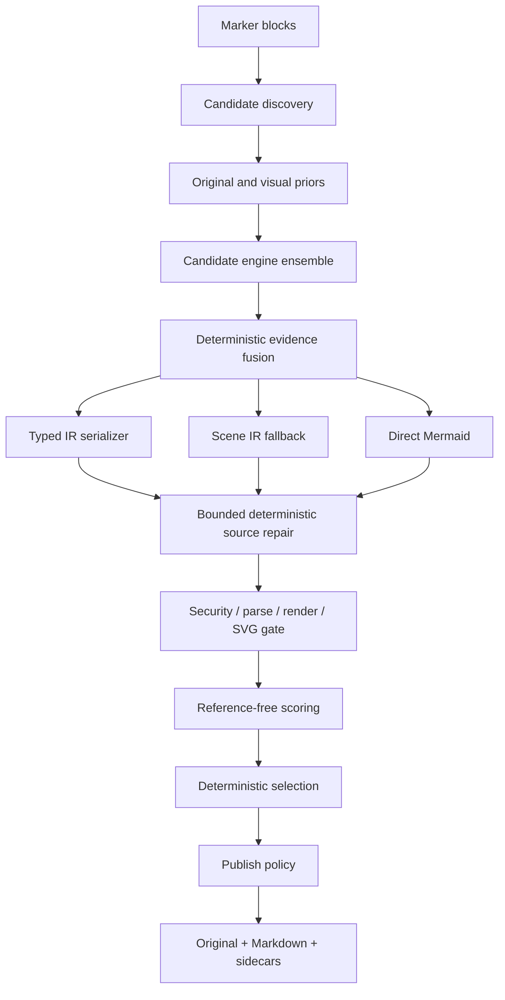

# Architecture

## Design goals

The central rule is that raw VLM text is never published directly. Source material, evidence,
Scene IR, typed IR, Mermaid candidates, and validation artifacts are separate so each stage can
be replaced or fail independently.

## Module boundaries

| Module | Responsibility |
| --- | --- |
| `models.py`, `typed_contracts.py` | Hook-free canonical scene/evidence/candidate snapshots, aggregate typed-IR budgets, and type-specific extraction-root contracts |
| `discovery.py`, `page_detector.py` | Panel, full-page, fragment, and missed-page-region proposals |
| `marker_discovery.py` | Marker block/`current_children` adapter, source registry, and deduplication |
| `source_assembly.py` | Panel/merged canvas assembly and source/page affine mapping |
| `geometry.py` | Conservative contour, Hough-line, and arrowhead conversion into Scene IR and provenance |
| `vector.py` | PDF vector/text extraction bounded by reconstruction-global raw-work budgets, an observation-local placement index, O(1) page/block lookup, and canvas affine transforms |
| `fusion.py` | Deterministic vector/geometry/OCR/VLM Scene fusion and limited Flowchart/Generic Network node-ID reconciliation |
| `mapping_validation.py` | Shared bounding-box, text, and contour-provenance gates for node-ID mappings |
| `views.py` | Type-aware thumbnails, edges, thresholds, overlays, and source-resolution tiles |
| `engines.py` | Bounded Marker `BaseService` adapter, stock Ollama inline-schema compatibility, and offline fixture engine |
| `flowchart_structure.py` | Shared node/group IDs and flat disjoint-subgraph emission plans |
| `serializers*.py`, `serialization.py` | Software/chart typed IR and requested/emitted-type fallback contracts |
| `ast_repair.py` | Bounded lexical/structural repair that adds no meaning, plus an AST-adapter seam |
| `semantic_repair.py` | Typed-flowchart node/conditional-edge label and directed-edge correction backed by exact text and high-confidence line/arrow evidence |
| `style_recovery.py` | Trusted-PDF-vector and profile-gated attribution for flowchart node/group fill, border, bold, and exactly mapped edge color/style |
| `security.py` | Fail-closed scanning for active or external Mermaid syntax |
| `validation.py` | Bounded nonblocking Chromium protocol, parse/render, SVG reinspection, and process-group cleanup |
| `scoring.py` | OCR/numeric scores, available-weight aggregation, and publication decisions |
| `quality.py` | Edge, arrow, layout, and path structural scores with unavailable-state handling |
| `evaluation.py` | Hash-bound corpus manifests and fixed MMX-001 release-gate/report aggregation |
| `candidate_scene.py` | Conversion of serializer-emitted nodes, relations, and subgraphs into an evaluation Scene |
| `accessibility.py` | Requested-type descriptions and emitted-grammar support checks |
| `pipeline.py` | Budgets, failure isolation, selection, and repair accepted only on improvement |
| `publication.py` | Canonical publication source and mutation-resistant policy certification |
| `marker_integration.py` | Processor ordering, Marker OCR provenance, and the dedicated renderer/converter |
| `sidecars.py`, `output.py`, `output_transaction.py` | Atomic diagram bundles and whole-document publication |
| `review_layout.py`, `review_store.py` | Bounded layout hints kept separate from source geometry, and review revisions |

`CandidateEngine`, `RepairEngine`, and `MermaidRuntime` are injected as protocols. The default
Marker/fixture CLI connects evidence-backed flowchart repair; other repair engines may implement
the structured-proposal contract. Default repair is limited to exact OCR/vector labels and to
direction reversals or unlabeled missing edges backed by high-confidence line/arrow evidence from
the built-in Geometry engine in the same source block. Colliding connector IDs, newly declared VLM
evidence, and pre-fusion direction conflicts grant no structural-repair authority. Label evidence
is trusted only from initial Marker OCR or exact Vector output after ID-collision, source-block,
and bounding-box checks.

Every repair call receives a candidate copy and an isolated `SourceContext` restricted first to
the candidate's closed publication-evidence authority. Evidence omitted from an earlier prompt
cannot be promoted later. An existing conditional edge label can be corrected only when trusted
OCR/vector text and a unique built-in Geometry connector agree with a one-to-one source/typed
endpoint mapping in the same direction. This label-only path changes no topology, node, endpoint,
direction, or layout; infers no branch or Yes/No meaning; and rejects parallel or reversed edges.
Repaired typed IR is checked again against input budgets and deterministic code synchronization.
Marker, LLM, and Chromium can each be replaced by fakes for tests and offline reproduction.

For an anchorless page proposal, an internal `PageGroup` metadata queue is the handoff boundary
between processors. The result and original crop reach sidecars, but not automatic Markdown.

## Coordinates and provenance

`DiagramSceneIR.coordinate_space` is `pixels` or `normalized`. The Marker adapter transforms OCR
bounding boxes through the fragment page bounding box and assembly page-to-canvas affine. Tokens
outside a panel are removed; tokens from later pages receive their fragment offsets. Every
evidence record retains its original Marker block ID. Scene relations may use `None` for an
unresolved endpoint, but model validation rejects references to nonexistent IDs.

`NodeIdMapping` is an audit record between an owner Scene ID and a fused Scene ID, not new visual
evidence. It records source and authority owners, vector/geometry authority, `match_method`
(`identity` or `unique_iou`), both bounding boxes, existing evidence IDs, and a canonical claim
digest. Records are immutable and selected-candidate mappings receive a process-private
certification seal. A mapping neither creates nor modifies provenance and does not replace the
page/canvas responsibility of `source-map.json`.

## Candidates and budgets

One engine observation can contain a type distribution, Scene IR, typed candidates, direct
candidates, and evidence. Engines run with failure isolation, while evidence from earlier engines
is added to the next engine's context and views. With multiple payloads, deterministic fusion uses
an explicit `fusion_source`, then fused and raw observation candidates are selected round-robin.
Input budgets cover observation lists, typed-IR depth/items/text, and direct source; each engine
serializes at most the candidate budget. After type top-k filtering and code-hash deduplication,
the default priority is typed IR, Scene fallback, then direct Mermaid.

After parse/render hard gates, automatic-publication ordering is deterministic by publication
eligibility, aggregate score, OCR recall, generation priority, and candidate ID. The
`review_required` and `sidecar_only` policies omit eligibility from sorting so review keeps its
aggregate-centered order. Typed candidates are first filtered/reordered by predicted top-k type,
preventing an out-of-top-k prefix from consuming a safe predicted-type serialization slot.

Fusion stops element/relation evidence and source-block unions before the shared 256-reference
record limit. An overflow cluster keeps the deterministic winner without cross-input enrichment;
all instances of the same evidence ID are decided together, so no partial union survives. The
pipeline reconstructs and validates every changed record, then rechecks fused Scene/evidence and
the exact-list/20,000-item collection contract before candidate generation, scoring, receipts, or
sidecars.

Separate from the 256 references per record, retained `VisualEvidence` permits at most 20,000
logical `source_block_ids` occurrences and 8,000,000 Python characters across those IDs.
Duplicates count because they consume memory. An independent 8,000,000-character full-evidence
limit includes `id`, `kind`, `text`, `font_weight`, and source-block IDs. Exact limits pass; a
single extra unit rejects the entire collection or reconstruction-global new-ID batch without a
bounded prefix. Hook-free snapshots use built-in field access and reconstruct detached
`VisualEvidence` records without live `model_dump`, subclass iteration, equality, or coercion.

This contract applies to initial/custom-engine evidence, reconstruction-global new-ID admission,
all fusion observations and sorting `prior_evidence`, fused output, final
`ReconstructionResult`, and publication/Markdown snapshots. Sidecars preflight before JSON,
deep-copy, or temporary-directory creation; document output preflights before image writes.
Public configuration and sidecar schema/manifest versions remain unchanged. Marker admits
source-crop/OCR records before append and, on overflow, isolates both evidence and OCR context
while reconstruction continues. Review root/revision reads, trusted replacement, digest/commit,
and structured `user_edit` additions canonicalize each raw record under the same boundary.
Evaluation applies the same raw-record source-block limits before constructing models while
retaining the public `0.1` artifact limits of 100,000 records and 64 MiB; artifact bytes replace
the runtime full-evidence character limit there.

Only fused `flowchart` and `generic_network` typed candidates enter the ID-reconciliation gate.
A typed node must reuse its owner Scene element ID exactly. That element must map uniquely at IoU
0.45 or higher to one independent vector/geometry node. Source evidence must predate the engine
call, its center and normalized text must match the owner node, and the authority contour must be
declared directly by the same vector/geometry observation, overlap its node, and have a
noncolliding provenance ID. Pixel Scene canvas and shared evidence block IDs are also bound to the
current source image dimensions and trusted block set.

Only a full, injective mapping with a distinct fused target for every node rewrites node IDs, edge
endpoints, and group members in one transaction. Any unsafe node leaves the whole candidate in
its original ID space; partial remapping is forbidden. Cross-engine direction conflicts are
carried to fused endpoint pairs and block later semantic repair. Nested Swimlane/BPMN, non-flow
typed IR, direct Mermaid, and Scene fallback are never rewritten by this path.

When native validation fails for Treemap, Venn, Packet, Ishikawa, TreeView, Wardley, or Cynefin,
the serializer may validate its explicit portable fallback once in the same candidate slot.
Architecture, C4, Deployment, and Component likewise retry their nested Flowchart fallback once
if `architecture-beta` runtime validation fails. The fallback must repeat source security,
parse/render, SVG, and terminal-runtime-type gates. Failure remains isolated to that candidate.
Success preserves the requested type; updates emitted/runtime type, the complete fallback chain,
warnings, and `runtime_portable_fallback` repair history; and consumes no extra candidate slot.
Native Cynefin remains review-only because of its fixed runtime template. Only the terminal
Flowchart projection of supplied domain subgraphs, explicit items, and explicit directed
transitions enters normal publication and generated-node attribution gates.

In the default Marker configuration, the PyMuPDF-backed Vector engine and Geometry engine produce
structural evidence first. Structured VLM sees only the OCR/evidence subset selected by bounded
structural quota and character budgets, plus separately validated image overlays. A Scene with no
readable node label remains grade `U` even if it renders, blocking automatic Markdown. Calling
`MarkerStructuredVLMEngine.observe()` outside the pipeline still snapshots the complete prior
evidence collection before prompt selection; even a discarded tail counts toward the 20,000
source-block occurrences and independent character budgets. Overflow or capture-time mutation
rejects the collection before view, prompt, or provider work. Selection and the provider then use
only that detached snapshot.

Before any engine call, source block/page IDs, OCR, initial evidence, and opaque block/vector
source lists are read only one item beyond each hard limit and frozen as plain snapshots. A
collection with invalid type, value, or aggregate limits is rejected as a whole in favor of a
safe default and records `CandidateFailure(stage="source_context")`. Engine evidence shares
reconstruction-global item/reference/character limits. If a new-ID batch exceeds remaining
budget, no prefix gains scoring or publication authority.

Vector extraction charges provider raw work rather than only records retained in the final
Scene. Default reconstruction-global limits are 2,048 primitives/commands, 5,000 vector-text
records and 8,000,000 text characters, and 256 vector sources. Configured primitives cannot
exceed 5,000 Scene elements, and configured primitive plus text maxima cannot exceed 20,000
observation evidence records. Closed dimensions never reopen for a later provider/source;
malformed, out-of-crop, duplicate, and empty nested inputs still consume work. Iterables stream
with one lookahead. Polygon/polyline records close atomically at 256/512 points; the shared limits
also include 100,000 retained points, 256-character vector metadata tokens, and 256 warnings.
After exact-hash deduplication, approximate deduplication is bounded to 250,000 comparisons and
text/node and endpoint matching to 1,000,000 each.

Built-in work counts, custom extractor output, and direct `VectorObservation` are bounded again at
engine/Scene boundaries. Duck-typed direct/dict/words span labels are read once into plain
snapshots and charged to the aggregate text budget. Before Scene/evidence allocation, canonical
source-block fan-out across valid deduplicated shape/text/open-line evidence is limited to exactly
20,000 logical references and 8,000,000 Python characters per reconstruction. Overflow atomically
produces an unknown prediction, empty Scene/evidence, and one warning; the pipeline converts that
warning-only observation into a bounded generation failure recorded in results and the sidecar
manifest. No public config/API is added.

Built-in vector observation indexes at most 256 placements and 256 block IDs per placement in one
pass, with all/page/block/page+block exact-dictionary keys, then performs O(1) lookup for at most
256 sources. Affine transforms are parsed only after a unique placement is selected and shared by
nested providers. A 257th placement invalidates the whole index; a 257th block ID atomically
removes that placement's block/page+block keys. Malformed transforms remain candidates during
selection so they cannot manufacture false uniqueness; an ambiguous or invalid selected mapping
falls back to bounding-box behavior. Huge exact integer coordinates/IDs fail before float or
decimal conversion. These controls belong to `VectorPrimitiveEngine` construction and the
integration layer, not public Marker JSON keys.

Typed IR uses the same canonical boundary at engine response, fusion ordering, accessibility
enrichment, repair, candidate keys, and sidecar sinks. Exact built-in JSON containers/scalars are
copied iteratively with depth/item/field limits, 1 MiB cumulative UTF-8 text, and 4 MiB compact
escaped JSON. One observation and fused output each permit at most 64 typed candidates totaling
8 MiB. A candidate envelope with more than three public fields is rejected before copying its
dictionary. Snapshots precede live `model_dump`, JSON encoding, or deep copy, so one oversized
sibling from a mutated plug-in is isolated.

Structured VLM prompts include enabled-type root contracts, actual view order/dimensions, a
selection manifest, and a request-budget reserve for Marker response-schema text. Changes to
earlier top-k types or evidence rebuild views under the appropriate type profile; large-source
tiles come from the pre-downscale original. Providers receive revalidated independent plain
Pillow snapshots, never caller-owned views. See [typed extraction](typed-extraction.md) and
[visual priors](visual-priors.md).

Fusion status is an internal pipeline boolean, not an engine name. A custom engine named
`deterministic_fusion` cannot access fused node mapping or fused evidence authority. Before
semantic repair, `SourceContext` is rebuilt from image, view, evidence, and source-mapping
snapshots never exposed to engines.

## Score semantics

Syntax and render results are both hard gates and inputs to the display-oriented total score.
Publication separately requires the non-runtime semantic threshold. When no semantic metric—OCR,
type fitness, provenance, edge agreement, and so on—is available, the aggregate is `None`.
Unavailable metrics are omitted and remaining weights renormalized rather than treated as zero.
Numeric metrics are computed only when source OCR contains numbers. See
[quality evaluation](quality.md) for structural-metric availability and limitations.
