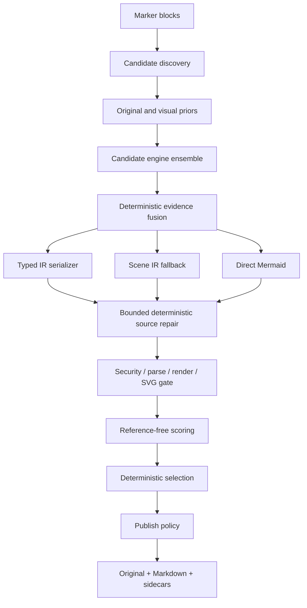

# 아키텍처

## 설계 목표

핵심은 VLM의 문자열 출력을 곧바로 게시하지 않는 것입니다. source, evidence, scene IR,
typed IR, Mermaid candidate, validation artifact를 분리하여 각 단계가 독립적으로 교체되고
실패할 수 있게 했습니다.

## 모듈 경계

| 모듈 | 책임 |
| --- | --- |
| `models.py`, `typed_contracts.py` | bounded scene/evidence/candidate 모델과 유형별 extraction root 계약 |
| `discovery.py`, `page_detector.py` | panel/full-page/fragment와 missed page region proposal |
| `marker_discovery.py` | Marker block/current_children adapter, source registry와 dedupe |
| `source_assembly.py` | panel/merged canvas 조립과 source/page affine mapping |
| `geometry.py` | contour, Hough line, arrowhead의 보수적 Scene IR/provenance 변환 |
| `vector.py` | duck-typed PDF vector/text primitive 추출과 canvas affine 변환 |
| `fusion.py` | vector/geometry/OCR/VLM Scene IR 결정적 병합과 제한된 Flowchart/Generic Network node-ID 정합화 |
| `mapping_validation.py` | node-ID mapping의 공용 bbox/text/contour provenance 정합성 gate |
| `views.py` | type-aware thumbnail/edge/threshold/overlay와 source-resolution tile 생성 |
| `engines.py` | Marker BaseService adapter와 offline fixture engine |
| `flowchart_structure.py` | node/group ID와 flat disjoint subgraph membership의 공용 emission plan |
| `serializers*.py`, `serialization.py` | software/chart typed IR, requested/emitted type와 fallback 계약 |
| `ast_repair.py` | 의미를 추가하지 않는 bounded lexical/structural repair와 AST adapter seam |
| `semantic_repair.py` | exact text와 고신뢰 line/arrow 근거가 있는 typed flowchart node/conditional-edge label·directed-edge 교정 |
| `style_recovery.py` | trusted PDF vector origin/profile-gated flowchart node·group fill/border/bold와 exact-mapped edge color/style attribution |
| `security.py` | active/external Mermaid syntax의 fail-closed 검사 |
| `validation.py` | bounded nonblocking Chromium protocol, parse/render, SVG 재검사, process-group 정리 |
| `scoring.py` | OCR/numeric score, available-weight aggregation, 게시 결정 |
| `quality.py` | edge/arrow/layout/path 구조 점수와 unavailable 판정 |
| `evaluation.py` | hash-bound corpus manifest와 고정 MMX-001 release gate/report 집계 |
| `candidate_scene.py` | typed serializer가 실제 방출한 node/relation/subgraph 구조를 평가 Scene으로 변환 |
| `accessibility.py` | requested type 기반 bounded 설명과 emitted grammar 지원 판정 |
| `pipeline.py` | budget, failure isolation, selection, 개선 시에만 repair 채택 |
| `marker_integration.py` | processor 순서, Marker OCR provenance, 전용 renderer/converter |
| `sidecars.py`, `output.py` | atomic diagram bundle과 문서 출력 |
| `review_layout.py`, `review_store.py` | source geometry와 분리된 bounded layout hint와 review revision |

`CandidateEngine`, `RepairEngine`, `MermaidRuntime`은 Protocol로 주입됩니다. 기본 Marker/fixture CLI는
evidence-backed flowchart repair를 연결하며 다른 repair engine도 구조화 proposal 계약으로 주입할 수 있습니다. 기본 repair는
exact OCR/vector label과 내장 Geometry engine에서 온 동일 source block의 고신뢰 line/arrow가 지지하는
방향 반전·무라벨 누락 edge만 다룹니다. Connector evidence ID가 충돌하거나 VLM이 새로 선언한 경우에는 구조
수정 권한을 부여하지 않으며 fusion 전 engine 방향 충돌도 별도 pair set으로 보존해 repair를 막습니다. Label
evidence도 초기 Marker OCR 또는 exact Vector engine만 trust하고 ID collision/source block/bbox를 확인합니다.
기존 조건 분기 edge label은 trusted OCR/vector text와 unique built-in Geometry connector가 동시에 지지하고
source/typed endpoint가 같은 방향으로 1:1 대응할 때만 label-only로 교정합니다. 이 경로는 topology, node,
endpoint, 방향, layout을 바꾸지 않으며 새 branch나 Yes/No 의미를 추론하지 않고 parallel/reversed edge를
거부합니다.
Repair typed IR은 입력 resource budget과 deterministic code 동기화를 다시 검증합니다. 테스트와 offline
재현은 Marker/LLM/Chromium을 각각 fake로 대체할 수 있습니다.

page proposal에 Figure/Picture/ComplexRegion anchor가 없으면 PageGroup 내부 metadata queue가 processor
사이의 전달 경계가 됩니다. 이 결과와 원본 crop은 sidecar 출력에 포함하지만 자동 Markdown에는
삽입하지 않습니다.

## 좌표와 provenance

`DiagramSceneIR.coordinate_space`는 `pixels` 또는 `normalized`입니다. Marker adapter는 fragment page
bbox와 assembly의 page→canvas affine으로 OCR bbox를 변환합니다. panel 밖 token은 제외하고 multi-page
token에는 fragment offset을 적용합니다. 모든 evidence는 원 Marker block ID를 보존합니다.
Scene relation은 endpoint가 아직 불명확할 때 `None`을 허용하지만, 존재하지 않는 ID 참조는
모델 validation에서 거부합니다.

`NodeIdMapping`은 새 visual evidence가 아니라 owner Scene ID와 fused Scene ID 사이의 audit record입니다.
source/authority owner, vector 또는 geometry authority, `match_method`(`identity`/`unique_iou`), 양쪽
bbox와 기존 evidence ID, canonical claim digest를 기록합니다. record는 immutable이며 pipeline은
selected candidate에 process-private certification seal을 붙입니다. mapping은 provenance를 만들거나 바꾸지 않으며
`source-map.json`의 page/canvas 좌표 책임도 대신하지 않습니다.

## 후보와 budget

engine observation 하나는 type distribution, Scene IR, typed candidates, direct candidates,
evidence를 함께 반환합니다. pipeline은 모든 engine을 failure-isolated 방식으로 호출하고, 앞선
engine의 evidence를 다음 engine context와 view에 합칩니다. payload가 둘 이상이면 명시적
`fusion_source`로 deterministic fusion을 수행하고 fused/원 observation 후보를 round-robin으로
뽑습니다. observation list, typed IR depth/item/text와 direct source에는 입력 budget을 적용하고 각 engine은
candidate budget까지만 직렬화합니다. type top-k와 code hash 중복 제거 후
기본 우선순위는 typed IR, Scene IR fallback, direct Mermaid입니다. 자동 게시 정책의 최종 정렬은
parse/render hard gate 뒤 publish eligibility, aggregate score, OCR recall, generation priority,
candidate ID 순서로 결정적입니다. `review_required`와 `sidecar_only`는 publish eligibility를 정렬에
사용하지 않아 기존 aggregate 중심 검토 순서를 유지합니다.
typed 후보는 prediction의 top-k type 순서로 먼저 filter/reorder한 뒤 candidate budget을 적용합니다.
따라서 top-k에 없는 앞쪽 후보가 안전한 predicted-type 후보의 직렬화 slot을 소비하지 않습니다.

fused observation의 `flowchart`와 `generic_network` typed 후보만 별도 ID 정합화 gate를 거칩니다. typed
node가 같은 owner Scene element ID를 정확히 재사용하고, 그 element가 독립 vector/geometry node 하나와
IoU 0.45 이상으로 유일하게 대응하며, source evidence가 engine 호출 전 payload snapshot에 있고 그 bbox
중심과 정규화 text가 owner Scene node에 대응해야 합니다. authority contour도 같은 vector/geometry
observation에서 직접 선언되고 bbox가 authority node와 겹치며 provenance ID가 충돌하지 않아야 합니다.
Pixel Scene canvas와 shared evidence block도 현재 source image 크기 및 trusted source block 집합에
결속합니다.
모든 node가 매핑되고 fused target이 서로 다른 full/injective mapping일 때만 node ID, edge endpoint,
group member를 한 transaction처럼
재작성합니다. 하나라도 불안전하면 후보를 통째로 원래 ID 공간에 두며 partial remap은 하지 않습니다.
mapped endpoint pair의 cross-engine direction conflict도 fused ID로 전파되어 뒤 semantic repair를
차단합니다. nested Swimlane/BPMN과 non-flow typed IR, direct Mermaid, Scene fallback은 이 경로에서
재작성하지 않습니다.

Treemap/Venn/Packet/Ishikawa/TreeView native validation이 실패하면 serializer가 명시한 portable fallback을
같은 candidate slot에서 한 번 재검증합니다. Architecture/C4/Deployment/Component도 `architecture-beta`
runtime validation이 실패할 때 같은 typed IR의 nested Flowchart fallback을 이 경로로 한 번만 시도합니다.
Fallback은 source security, parse/render, SVG와 terminal runtime type gate를 전부 다시 통과해야 하며,
실패는 해당 후보에만 격리됩니다. 성공하면 requested type은 유지하고 emitted/runtime type, 전체
`architecture → flowchart` 또는 `requested → architecture → flowchart` chain, warning과
`runtime_portable_fallback` repair history를 갱신합니다. 같은 slot을 재사용하므로 candidate budget은
늘어나지 않습니다.

Marker 기본 구성에서는 PyMuPDF page provider를 연결한 VectorPrimitiveEngine과 GeometryEngine이 먼저 구조 evidence를 만들고
Structured VLM이 그 evidence와 OCR token을 prompt에서 함께 봅니다. scene node에 읽을 수 있는
label이 하나도 없으면 문법적으로 렌더 가능해도 `U`로 두어 자동 Markdown 게시를 막습니다.

Structured VLM prompt는 `enabled_types`에 해당하는 typed root contract와 실제 view 순서/크기를
포함합니다. 앞선 engine의 top-k type 또는 evidence가 바뀌면 view를 type profile에 맞춰 다시 만들며,
큰 source의 tile은 축소 전 원본에서 잘라냅니다. 자세한 계약은 [typed extraction](typed-extraction.md)과
[visual priors](visual-priors.md)를 참고합니다.

## 점수의 의미

syntax/render는 hard gate이자 표시용 total score input입니다. 게시 결정은 non-runtime semantic score의
threshold도 별도로 요구합니다. OCR, type fitness, provenance, edge agreement 등
사용 가능한 의미 지표가 하나도 없으면 aggregate는 `None`입니다. 사용할 수 없는 지표를 0으로
간주하지 않고 남은 가중치만 정규화합니다. 숫자 지표도 원본 OCR에 숫자가 있을 때만 계산합니다.
구조 점수의 available 조건과 한계는 [품질 평가](quality.md)에 정리합니다.
