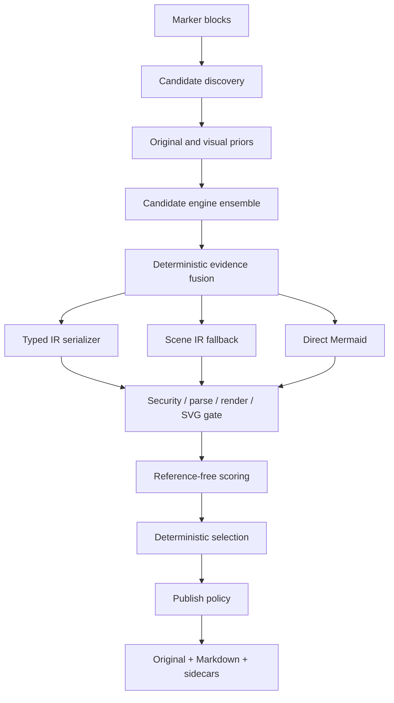

# 아키텍처

## 설계 목표

핵심은 VLM의 문자열 출력을 곧바로 게시하지 않는 것입니다. source, evidence, scene IR,
typed IR, Mermaid candidate, validation artifact를 분리하여 각 단계가 독립적으로 교체되고
실패할 수 있게 했습니다.

## 모듈 경계

| 모듈 | 책임 |
| --- | --- |
| `models.py` | scene, evidence, prediction, candidate, result 모델과 참조 무결성 |
| `discovery.py` | panel/full-page/fragment proposal와 virtual source fragment 모델 |
| `marker_discovery.py` | Marker block/current_children adapter, source registry와 dedupe |
| `source_assembly.py` | panel/merged canvas 조립과 source/page affine mapping |
| `geometry.py` | contour, Hough line, arrowhead의 보수적 Scene IR/provenance 변환 |
| `vector.py` | duck-typed PDF vector/text primitive 추출과 canvas affine 변환 |
| `fusion.py` | vector/geometry/OCR/VLM Scene IR와 후보의 결정적 병합 |
| `views.py` | thumbnail, edge, Hough, detected-arrow, OCR/vector/color overlay, tile 생성 |
| `engines.py` | Marker BaseService adapter와 offline fixture engine |
| `serializers*.py`, `serialization.py` | software/chart typed IR, requested/emitted type와 fallback 계약 |
| `security.py` | active/external Mermaid syntax의 fail-closed 검사 |
| `validation.py` | reusable Chromium worker, parse/render, SVG 재검사, process 정리 |
| `scoring.py` | OCR/numeric score, available-weight aggregation, 게시 결정 |
| `quality.py` | edge/arrow/layout/path 구조 점수와 unavailable 판정 |
| `candidate_scene.py` | typed serializer가 실제 방출한 구조를 평가 Scene으로 변환 |
| `pipeline.py` | budget, failure isolation, selection, 개선 시에만 repair 채택 |
| `marker_integration.py` | processor 순서, Marker OCR provenance, 전용 renderer/converter |
| `sidecars.py`, `output.py` | atomic diagram bundle과 문서 출력 |

`CandidateEngine`, `RepairEngine`, `MermaidRuntime`은 Protocol로 주입됩니다. 테스트와 offline
재현은 Marker/LLM/Chromium을 각각 fake로 대체할 수 있습니다.

## 좌표와 provenance

`DiagramSceneIR.coordinate_space`는 `pixels` 또는 `normalized`입니다. Marker adapter는 fragment page
bbox와 assembly의 page→canvas affine으로 OCR bbox를 변환합니다. panel 밖 token은 제외하고 multi-page
token에는 fragment offset을 적용합니다. 모든 evidence는 원 Marker block ID를 보존합니다.
Scene relation은 endpoint가 아직 불명확할 때 `None`을 허용하지만, 존재하지 않는 ID 참조는
모델 validation에서 거부합니다.

## 후보와 budget

engine observation 하나는 type distribution, Scene IR, typed candidates, direct candidates,
evidence를 함께 반환합니다. pipeline은 모든 engine을 failure-isolated 방식으로 호출하고, 앞선
engine의 evidence를 다음 engine context와 view에 합칩니다. payload가 둘 이상이면 명시적
`fusion_source`로 deterministic fusion을 수행하고 fused/원 observation 후보를 round-robin으로
뽑습니다. type top-k와 code hash 중복 제거 후
기본 우선순위는 typed IR, Scene IR fallback, direct Mermaid입니다. 최종 정렬은 hard gate,
aggregate score, OCR recall, generation priority, candidate ID 순서로 결정적입니다.

Marker 기본 구성에서는 VectorPrimitiveEngine과 GeometryEngine이 먼저 구조 evidence를 만들고
Structured VLM이 그 evidence와 OCR token을 prompt에서 함께 봅니다. scene node에 읽을 수 있는
label이 하나도 없으면 문법적으로 렌더 가능해도 `U`로 두어 자동 Markdown 게시를 막습니다.

## 점수의 의미

syntax/render는 hard gate이자 score input입니다. OCR, type fitness, provenance, edge agreement 등
사용 가능한 의미 지표가 하나도 없으면 aggregate는 `None`입니다. 사용할 수 없는 지표를 0으로
간주하지 않고 남은 가중치만 정규화합니다. 숫자 지표도 원본 OCR에 숫자가 있을 때만 계산합니다.
구조 점수의 available 조건과 한계는 [품질 평가](quality.md)에 정리합니다.
