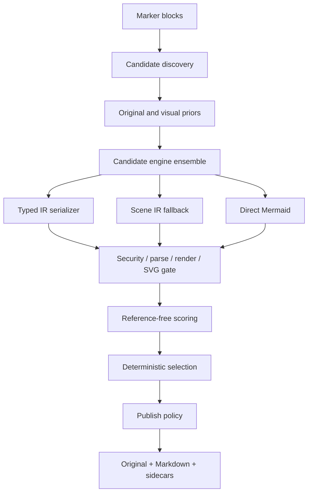

# 아키텍처

## 설계 목표

핵심은 VLM의 문자열 출력을 곧바로 게시하지 않는 것입니다. source, evidence, scene IR,
typed IR, Mermaid candidate, validation artifact를 분리하여 각 단계가 독립적으로 교체되고
실패할 수 있게 했습니다.

## 모듈 경계

| 모듈 | 책임 |
| --- | --- |
| `models.py` | scene, evidence, prediction, candidate, result 모델과 참조 무결성 |
| `views.py` | thumbnail, edge, Hough, arrow, OCR overlay, tile 생성 |
| `engines.py` | Marker BaseService adapter와 offline fixture engine |
| `serializers.py` | Phase 1 typed IR 및 portable Scene IR fallback |
| `security.py` | active/external Mermaid syntax의 fail-closed 검사 |
| `validation.py` | reusable Chromium worker, parse/render, SVG 재검사, process 정리 |
| `scoring.py` | OCR/numeric score, available-weight aggregation, 게시 결정 |
| `pipeline.py` | budget, failure isolation, selection, 개선 시에만 repair 채택 |
| `marker_integration.py` | processor 순서, Marker OCR provenance, 전용 renderer/converter |
| `sidecars.py`, `output.py` | atomic diagram bundle과 문서 출력 |

`CandidateEngine`, `RepairEngine`, `MermaidRuntime`은 Protocol로 주입됩니다. 테스트와 offline
재현은 Marker/LLM/Chromium을 각각 fake로 대체할 수 있습니다.

## 좌표와 provenance

`DiagramSceneIR.coordinate_space`는 `pixels` 또는 `normalized`입니다. Marker adapter는 block
crop pixel 좌표로 OCR bbox를 변환합니다. 모든 evidence는 원 Marker block ID를 보존합니다.
Scene relation은 endpoint가 아직 불명확할 때 `None`을 허용하지만, 존재하지 않는 ID 참조는
모델 validation에서 거부합니다.

## 후보와 budget

engine observation 하나는 type distribution, Scene IR, typed candidates, direct candidates,
evidence를 함께 반환합니다. pipeline은 type top-k를 먼저 적용하고 code hash로 중복을 제거한
후 candidate budget에서 정확히 멈춥니다. 기본 우선순위는 typed IR, Scene IR fallback,
direct Mermaid입니다. 최종 정렬은 hard gate, aggregate score, OCR recall, generation priority,
candidate ID 순서로 결정적입니다.

## 점수의 의미

syntax/render는 hard gate이자 score input입니다. OCR, type fitness, provenance, edge agreement 등
사용 가능한 의미 지표가 하나도 없으면 aggregate는 `None`입니다. 사용할 수 없는 지표를 0으로
간주하지 않고 남은 가중치만 정규화합니다. 숫자 지표도 원본 OCR에 숫자가 있을 때만 계산합니다.
